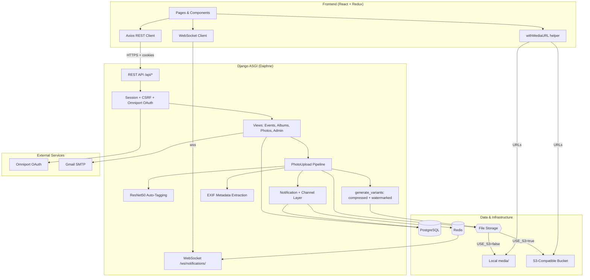
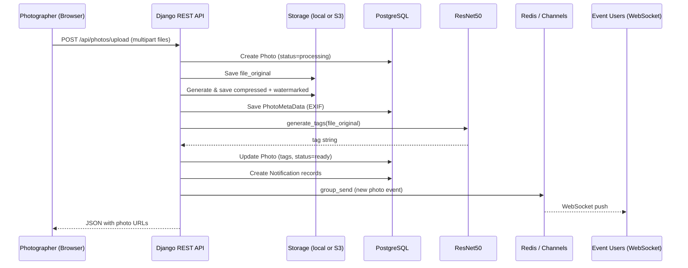
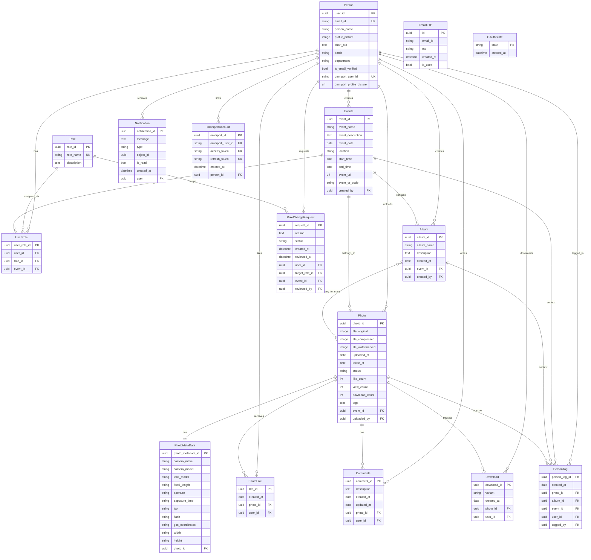

# 📸 Smart Event Photo Management Platform

A **full-stack, AI-powered, real-time event photo management platform** designed to simplify how photos are uploaded, discovered, and shared during large events such as college fests, conferences, hackathons, and competitions.

The platform combines **secure authentication**, **AI-based image understanding**, **real-time notifications**, **S3-compatible cloud media storage**, and **batch photo operations** into a single, scalable system.

---

## What This Application Does

This platform allows:
- Photographers to upload event photos effortlessly
- Users to automatically discover photos they are part of
- Admins to manage users, events, and content
- Everyone to receive **real-time updates** when new photos are uploaded

Manual photo tagging and scattered sharing are completely eliminated.

---

## Core Features

### Authentication & Authorization
- Omniport OAuth-based login
- Email registration with OTP verification
- Secure session-based authentication
- Role-based permissions across the platform

---

### Role System
- **Admin**
  - Manage users and roles
  - Delete any photo
  - Moderate events and albums
- **Photographer**
  - Upload photos
  - Tag people
- **Event Manager**
  - Manage event albums
- **User**
  - View, like, and download photos
  - Receive notifications when tagged

---

### Photo Management
- Upload single or multiple photos
- Automatic generation of:
  - Original image
  - Compressed image
  - Watermarked image
- Track photo metrics:
  - Likes
  - Views
  - Downloads

---

### Cloud Media Storage (S3-Compatible)
- Optional **S3-compatible** object storage via `django-storages` + `boto3`
- Supported providers: **AWS S3**, **Cloudflare R2**, **Supabase Storage**, **Backblaze B2**
- When enabled, originals and variants are stored in the cloud; API responses return public `https://` URLs
- Local `backend/media/` is used when cloud storage is disabled (default for development)
- Storage-agnostic image processing (PIL reads/writes work for both local disk and S3)

---

### AI-Based Auto Tagging
- Uses **ResNet50 (ImageNet pre-trained model)**
- Automatically generates descriptive tags such as:
  - `people`, `crowd`, `stage`, `car`, `sunset`, `nature`
- Tags are stored per photo
- Enables powerful search and tag-based filtering

No manual tagging required.

---

### Smart Photo Layouts
Users can switch between:
- Grid (3 images)
- Grid (4 images)
- Masonry layout
- Timeline view (grouped by upload date)

---

### Search & Tag Filtering
- Search photos by:
  - Photographer name
  - Photo ID
  - Auto-generated AI tags
- Filter photos using a dropdown of available tags

---

### Batch Operations
- Multi-select photos
- Perform actions on multiple photos at once:
  - Like
  - Download (original / compressed / watermarked)
  - Delete (admin only)
  - Remove from album

---

### Real-Time Notifications
- Implemented using **Django Channels + WebSockets**
- Notifications triggered for:
  - New photo uploads in events
  - User tagging
- Delivered instantly without refreshing the page

---

## Tech Stack

### Backend
- Django 5
- Django REST Framework
- Django Channels + Daphne
- Redis (channel layer)
- PostgreSQL
- TensorFlow + Keras (auto-tagging)
- Pillow
- django-storages + boto3 (S3-compatible storage)

### Frontend
- React (TypeScript)
- Redux Toolkit
- Tailwind CSS
- Axios
- WebSockets

---

## System Architecture

High-level flow from the browser through the API, processing pipeline, persistence, and real-time delivery.



### Photo upload pipeline (detailed)



---

## Database Schema

PostgreSQL is the primary database (`AUTH_USER_MODEL = core.Person`). Below is the logical schema of all application tables and relationships.



| Table | Purpose |
|-------|---------|
| `Person` | Custom user (email login, profile, Omniport fields) |
| `Role` / `UserRole` | Global or per-event role assignments |
| `Events` | Event metadata and ownership |
| `Album` | Curated photo collections within events |
| `Photo` | Original, compressed, and watermarked assets + AI tags |
| `PhotoMetaData` | EXIF/camera data (1:1 with photo) |
| `PhotoLike`, `Comments`, `Download` | Engagement and download tracking |
| `PersonTag` | User tagging on photos, albums, or events |
| `Notification` | In-app notification records |
| `RoleChangeRequest` | User requests for role upgrades (admin review) |
| `OmniportAccount` | OAuth tokens linked to a person |
| `EmailOTP` | Email verification codes |
| `OAuthState` | CSRF state for Omniport OAuth |

---

## Backend Setup

All commands below assume you are in the **`backend/`** directory.

### 1️⃣ Create a Virtual Environment

```bash
python -m venv .venv
source .venv/bin/activate      # Linux / macOS
.venv\Scripts\activate         # Windows
```

### 2️⃣ Install Backend Dependencies (`requirements.txt`)

Dependencies are defined in [`backend/requirements.txt`](backend/requirements.txt). Install everything in one step:

```bash
pip install -r requirements.txt
```

| Package group | Purpose |
|---------------|---------|
| Django, DRF | API and admin |
| channels, channels-redis, daphne | WebSockets / ASGI |
| psycopg2-binary | PostgreSQL |
| Pillow, numpy, tensorflow, keras | Images + AI auto-tagging |
| django-storages, boto3 | S3-compatible cloud storage |
| python-dotenv, requests | Configuration and Omniport HTTP |
| django-cors-headers, django-extensions, django-sslserver | CORS, dev tools, local HTTPS |

### 3️⃣ Environment Variables

Copy the example env file and fill in your values:

```bash
cp .env.example .env
```

See [☁️ Cloud Storage Setup](#️-cloud-storage-setup) and [🚂 Deployment on Railway](#-deployment-on-railway) for production-related variables.

### 4️⃣ Redis Setup (required for WebSockets)

Redis powers the Django Channels layer (real-time notifications).

**Windows:** [Redis releases](https://github.com/microsoftarchive/redis/releases)

**Linux:**
```bash
sudo apt install redis-server
```

Start Redis (default `localhost:6379`):
```bash
redis-server
```

### 5️⃣ PostgreSQL

Create a database (default name in `settings.py`: `photomanager`) and ensure credentials in `.env` or `settings.py` match your local instance.

### 6️⃣ Apply Database Migrations

```bash
python manage.py makemigrations
python manage.py migrate
```

### 7️⃣ Create Superuser (Admin)

```bash
python manage.py createsuperuser
```

Django Admin: http://127.0.0.1:8000/admin

### 8️⃣ Create Roles (mandatory)

Without roles, permission checks and `isAdmin` logic will not work. In Django Admin, create:

- `ADMIN`
- `PHOTOGRAPHER`
- `USER`
- `EVENT_MANAGER`

### 9️⃣ Assign Admin Role to Superuser

In Django Admin → **UserRole**, assign your superuser the **ADMIN** role. Even superusers need this role for app-level permission checks.

### 🔟 Start Backend Server

```bash
python manage.py runserver
```

Backend API: http://127.0.0.1:8000/api/

---

## Cloud Storage Setup

Media files (profile pictures, photo originals, compressed and watermarked variants) can be stored locally or in an **S3-compatible** bucket.

### Configuration

Set in `backend/.env` (see [`backend/.env.example`](backend/.env.example)):

| Variable | Description |
|----------|-------------|
| `USE_S3` | `true` to enable cloud storage; `false` for local `backend/media/` |
| `AWS_ACCESS_KEY_ID` | Access key from your provider |
| `AWS_SECRET_ACCESS_KEY` | Secret key |
| `AWS_STORAGE_BUCKET_NAME` | Bucket name |
| `AWS_S3_REGION_NAME` | Region (`auto` for Cloudflare R2) |
| `AWS_S3_ENDPOINT_URL` | Required for R2 / Supabase; omit for AWS S3 |
| `AWS_S3_CUSTOM_DOMAIN` | Optional public CDN/custom domain |
| `AWS_S3_FILE_OVERWRITE` | Default `false` (recommended) |

**Example — Cloudflare R2:**
```env
USE_S3=true
AWS_ACCESS_KEY_ID=your_r2_access_key
AWS_SECRET_ACCESS_KEY=your_r2_secret
AWS_STORAGE_BUCKET_NAME=event-photos
AWS_S3_REGION_NAME=auto
AWS_S3_ENDPOINT_URL=https://<ACCOUNT_ID>.r2.cloudflarestorage.com
AWS_S3_CUSTOM_DOMAIN=photos.yourdomain.com
```

When `USE_S3=true`, Django uses `storages.backends.s3.S3Storage` as the default file backend. The frontend resolves media via `VITE_APP_MEDIA_URL` for relative paths, or uses full `https://` URLs returned by the API when cloud storage is active.

### Verify storage

```bash
python manage.py test_cloud_storage
```

This writes, reads, and deletes a test object via the configured storage backend.

---

## Frontend Setup

From the repository root:

```bash
cd frontend
npm install
```

Create `frontend/.env` if needed:
```env
VITE_APP_API_URL=http://127.0.0.1:8000/api
VITE_APP_MEDIA_URL=http://127.0.0.1:8000
```

For S3/R2, set `VITE_APP_MEDIA_URL` to your bucket base URL or CDN domain when the API returns relative paths.

Start the dev server:
```bash
npm start
```

Frontend: http://localhost:3000

---

## Deployment on Railway

Planned production layout:

| Service | Role |
|---------|------|
| **Web** (Django + Daphne) | REST API, WebSockets, image processing |
| **PostgreSQL** | Primary database (`DATABASE_URL`) |
| **Redis** | Channel layer for notifications |
| **S3-compatible storage** | Media (set `USE_S3=true`) |

**Checklist:**
1. Set `SECRET_KEY`, `DEBUG=False`, and `ALLOWED_HOSTS` for your Railway domain.
2. Point `DATABASE_URL` at the Railway Postgres plugin (or map into `DATABASES` in settings).
3. Set `REDIS_URL` / channel layer hosts to the Railway Redis instance.
4. Enable cloud storage (`USE_S3=true`) and all `AWS_*` variables — do not rely on ephemeral container disk for uploads.
5. Set `OMNIPORT_REDIRECT_URI`, `CORS_ALLOWED_ORIGINS`, and `CSRF_TRUSTED_ORIGINS` to your production frontend/backend URLs.
6. Run `python manage.py migrate` on deploy.
7. Use `daphne backend.asgi:application` (or your Procfile command) for HTTP + WebSocket on one process.

---

## Omniport Authentication Flow

1. User clicks **Login with Omniport**
2. Redirected to Omniport OAuth
3. Omniport redirects back with authorization code
4. Backend exchanges code for tokens
5. User data fetched from Omniport
6. User is created or logged in; `OmniportAccount` stores tokens
7. Session is established securely

---

## AI Auto-Tagging Workflow

1. Triggered automatically on photo upload
2. Uses ResNet50 (ImageNet pre-trained model)
3. Detects objects and scenes
4. Converts predictions into readable tags
5. Tags stored on the `Photo` record

Used for search, tag filtering, and photo discovery. No manual model training required.

---

## Notifications Flow

1. Photo uploaded or user tagged
2. `Notification` row stored in PostgreSQL
3. Redis + Channels broadcasts to the user's group
4. WebSocket (`/ws/notifications/`) pushes to the frontend instantly

---

## User Flow Summary

### Regular User
- Login via Omniport or email
- Browse events and albums
- Get notified when tagged
- Like and download photos
- Filter photos using tags

### Photographer
- Upload photos (stored locally or in S3)
- Auto-tagging runs automatically
- Tag people in photos
- Photos appear live to users

### Admin
- Manage users and roles
- Delete photos
- Moderate content

---

## Security Highlights

- Role-based permissions on API endpoints
- Secure OAuth handling with `OAuthState`
- Session cookies with CSRF protection
- Authenticated WebSockets
- API-level access control per role
- Secrets and credentials via `.env` (never commit `.env`)

---

## Project Structure

```
Smart-Event-Photo-Management-Platform/
├── backend/
│   ├── requirements.txt      # Python dependencies
│   ├── .env.example          # Environment template (S3, Omniport, DB)
│   ├── backend/              # Django project (settings, ASGI, routing)
│   └── core/                 # Models, views, serializers, storage utils
├── frontend/                 # React TypeScript app
└── README.md
```
